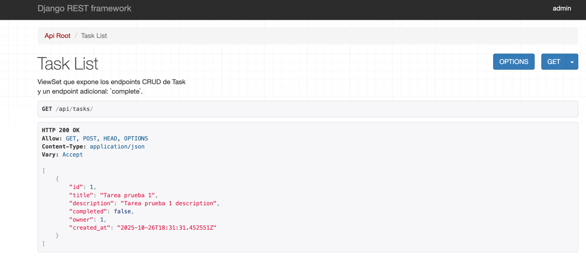
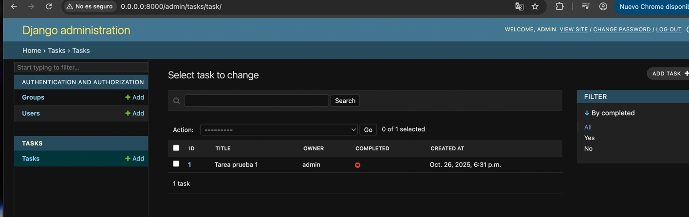

# 🧩 Django REST API — Clean Architecture + SOLID + Docker

This project is a practical and educational example of how to build a professional REST API with:
- Django 4.2 + Django REST Framework
- SOLID principles and Clean Code
- Docker and docker-compose
- Makefile to automate tasks
- Unit and functional tests with Pytest

---

## 🚀 Goal

Show how to structure a Django project in a modular, maintainable, and easily testable way by separating responsibilities into layers.

| Layer | Folder | Responsibility |
|------|----------|-----------------|
| API / Infrastructure | `api/` | Global Django configuration and URLs |
| Domain / Application | `tasks/` | Models, business logic, serialization, services, and endpoints |
| External infrastructure | `Dockerfile`, `docker-compose.yml` | Containers and dependencies |
| Automation / DevOps | `Makefile` | Commands for common tasks |

---

## Frontend
    http://0.0.0.0:8000/api/tasks/

## Admin
    http://0.0.0.0:8000/admin/tasks/task/

## 📂 Project structure

```
django-api-rest-example/
├── Makefile
├── Dockerfile
├── README.md
├── docker-compose.yml
├── entrypoint.sh
├── requirements.txt
├── pytest.ini
├── manager.py
├── api/
│   ├── __init__.py
│   ├── settings.py
│   ├── urls.py
│   └── wsgi.py
└── tasks/
    ├── __init__.py
    ├── admin.py
    ├── apps.py
    ├── models.py
    ├── serializers.py
    ├── repositories.py
    ├── services.py
    ├── views.py
    ├── urls.py
    └── tests/
        ├── test_serializers.py
        ├── test_services.py
        └── test_api.py
    └── migrations/
        ├── __init__.py
        ├── 0001_initial.py
```

---

## ⚙️ Installation and run

### 1️⃣ Clone the project
```bash
git clone git@github.com:jcmoro/api-rest-django-example.git
```

### 2️⃣ Build and start containers
```bash
make up
```

### 3️⃣ Apply migrations
```bash
make migrate
```

### 4️⃣ Open the API
The API will be available at 👉 [http://localhost:8000/api/tasks/](http://localhost:8000/api/tasks/)

---

## 🧪 Tests

Run all tests (unit + functional):
```bash
make test
```

Run only unit tests:
```bash
make test-unit
```

Run only functional tests:
```bash
make test-functional
```

---

## 🧠 Principles applied

- Single Responsibility Principle (SRP): each class has a specific purpose.
- Open/Closed Principle (OCP): services and repositories can be extended without modifying existing code.
- Dependency Inversion Principle (DIP): services depend on abstractions (repositories), not concrete implementations.
- Clean Code: readable code, short functions, descriptive names, and clear separation of concerns.

---

## 📡 Endpoints

| Method | Path | Description |
|---------|------|-------------|
| `GET` | `/api/tasks/` | List tasks |
| `POST` | `/api/tasks/` | Create a new task |
| `POST` | `/api/tasks/{id}/complete/` | Mark a task as completed |
| `GET` | `/api/tasks/{id}/` | Task detail |
| `PUT/PATCH/DELETE` | `/api/tasks/{id}/` | CRUD operations |

```
HTTP 200 OK
Allow: GET, POST, HEAD, OPTIONS
Content-Type: application/json
Vary: Accept
[
    {
        "id": 1,
        "title": "Sample task 1",
        "description": "Sample task 1 description",
        "completed": false,
        "owner": 1,
        "created_at": "2025-10-26T18:31:31.452551Z"
    }
]
```

## 🧰 Available Makefile commands

To see all available options in the Makefile, run:

```bash
make help
```

### Example output from the Makefile

```makefile
Usage:
 make <target>

📖 Automatic help
 help                  Display help
 create-admin          Create user admin django

🐳 Docker
 build                 Build Docker images (no cache)
 up                    Start containers (build first)
 run                   Start the development server
 down                  Stop and remove containers, networks and volumes
 restart               Fully restart the environment
 logs                  Show web service logs

⚙️ Django
 migrate               Run Django migrations
 makemigrations        Create new migrations
 shell                 Open an interactive Django shell

🧪 Tests
 test                  Run all tests (unit + functional)
 test-unit             Run only mocked unit tests (fast, no DB)
 test-functional       Run functional tests (require DB)
 list-tasks            List tasks locally

🔍 Code quality
 lint                  Run flake8 to check style
 format                Run black to auto-format code
 
```
## Screenshots


---

## 🧑‍💻 Author
**José Carlos Moro Díaz**  
💼 GitHub: [@jcmoro](https://github.com/jcmoro)  
✉️ Contact: jcmorodiaz@gmail.com